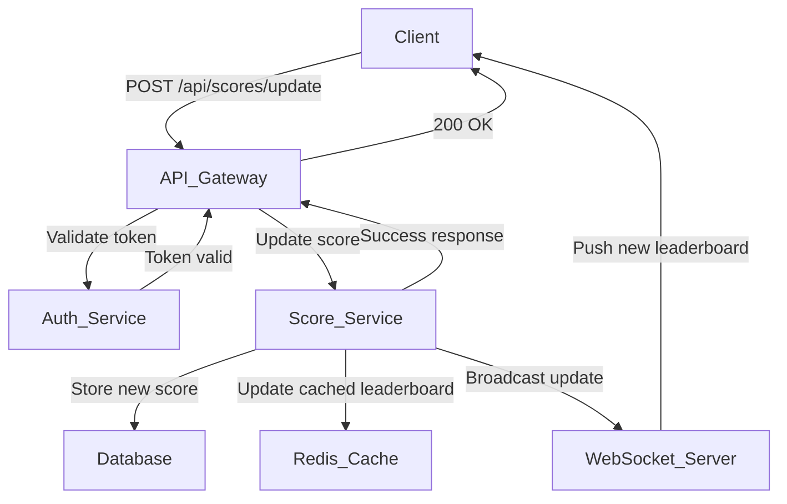

# Live Scoreboard Module

## Overview
The Live Scoreboard Module manages and updates user scores in real-time, ensuring a secure scoring system and broadcasting updates to connected clients. It guarantees data integrity while providing instant updates to the top 10 leaderboard.

## System Architecture


## Core Components

### 1. Score Service
- Handles score updates and leaderboard management.
- Validates incoming score update requests.
- Maintains score integrity and prevents unauthorized updates.
- Updates both database and cache layers.

### 2. WebSocket Server
- Manages real-time connections with clients.
- Broadcasts leaderboard updates to all connected clients.
- Handles connection and disconnection events.
- Implements reconnection logic.

### 3. Caching Layer (Redis)
- Stores the current top 10 leaderboard.
- Provides fast access to frequently requested data.
- Uses a sorted set for efficient ranking.

## API Endpoints

### Update Score
```http
POST /api/scores/update
Authorization: Bearer {jwt_token}
```
**Request Body:**
```json
{
  "actionId": "string",
  "timestamp": "ISO8601 string"
}
```
**Response:**
```json
{
  "success": true,
  "newScore": number,
  "rank": number
}
```

### Get Leaderboard
```http
GET /api/leaderboard
```
**Response:**
```json
{
  "leaderboard": [
    {
      "userId": "string",
      "username": "string",
      "score": number,
      "rank": number
    }
  ]
}
```

## WebSocket Events

### Connection
```ws
ws://api.domain.com/ws/leaderboard
```
**Headers:**
```http
Authorization: Bearer {jwt_token}
```

### Event Types
1. `leaderboard_update`: Broadcasted when scores change.
2. `connection_success`: Sent on successful connection.
3. `error`: Sent when an error occurs.

## Security Measures

1. **Authentication**
   - JWT-based authentication for all API requests.
   - WebSocket connections require a valid JWT.
   - Tokens include user identification and permissions.

2. **Action Validation**
   - Each score update requires a valid `actionId`.
   - Timestamp validation to prevent replay attacks.
   - Rate limiting per user.

3. **Data Integrity**
   - Score updates are atomic operations.
   - Transaction-based updates to prevent race conditions.
   - Score change audit logging.

## Performance Considerations

1. **Caching Strategy**
   - Leaderboard cached in a Redis sorted set.
   - Cache invalidation on score updates.
   - Periodic sync with the database.

2. **Scaling**
   - Horizontal scaling of WebSocket servers.
   - Redis cluster for high availability.
   - Load balancing for API endpoints.

## Error Handling

1. **API Errors**
   - Standard HTTP status codes.
   - Detailed error messages.
   - Error logging and monitoring.

2. **WebSocket Errors**
   - Automatic reconnection.
   - Error event broadcasting.
   - Connection state management.

## Implementation Notes

### Database Schema
```sql
CREATE TABLE user_scores (
    user_id VARCHAR(36) PRIMARY KEY,
    username VARCHAR(255) NOT NULL,
    score INTEGER NOT NULL DEFAULT 0,
    last_updated TIMESTAMP NOT NULL,
    CONSTRAINT score_positive CHECK (score >= 0)
);

CREATE TABLE score_updates (
    id VARCHAR(36) PRIMARY KEY,
    user_id VARCHAR(36) NOT NULL,
    action_id VARCHAR(36) NOT NULL,
    score_change INTEGER NOT NULL,
    timestamp TIMESTAMP NOT NULL,
    FOREIGN KEY (user_id) REFERENCES user_scores(user_id)
);
```

### Redis Structure
```bash
ZADD leaderboard {score} {user_id}
```

## Additional Recommendations

1. **Monitoring & Analytics**
   - Implement Prometheus metrics for:
     - Score update frequency.
     - WebSocket connection count.
     - Cache hit/miss ratio.
   - Set up alerting for anomalies.

2. **Anti-Abuse Measures**
   - Implement score change velocity checking.
   - Add IP-based rate limiting.
   - Set up automated flagging for suspicious activities.

3. **Performance Optimization**
   - Consider sharding for high-traffic scenarios.
   - Implement batch updates for multiple score changes.
   - Add request queuing for high-load periods.

4. **Testing Requirements**
   - Unit tests for score calculation logic.
   - Integration tests for real-time updates.
   - Load testing for WebSocket connections.
   - Security penetration testing.
